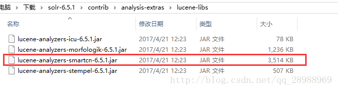
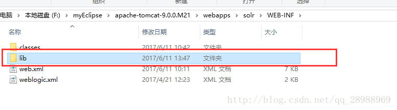
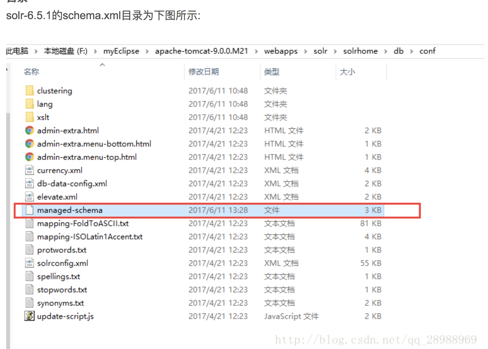

solr的同步发行包smartcn可进行中文切词，smartcn的分词准确率不错，但就是不能自己定义新的词库，不过smartcn是跟solr同步的，所以不需要额外的下载，只需在solr的例子中拷贝进去即可。 
第一步: 
找到如下目录，复制中文分词器jar到solr项目的WEB-INF/lib目录下: 

 
第二步: 
在自定义的core下配置schema

<types>
    <!-- 配置中文分词器 -->
    <fieldType name="text_smartcn" class="solr.TextField" positionIncrementGap="100">
        <analyzer type="index">
            <tokenizer class="org.apache.lucene.analysis.cn.smart.HMMChineseTokenizerFactory"/>
        </analyzer>
        <analyzer type="query">
            <tokenizer class="org.apache.lucene.analysis.cn.smart.HMMChineseTokenizerFactory"/>
        </analyzer>
    </fieldType>
</types>
  ● 12
第三步:
将需要中文分词的字段类型替换成上述类型:
<field name="goodsName" type="text_smartcn" indexed="true" stored="true" required="true" multiValued="false" /> 